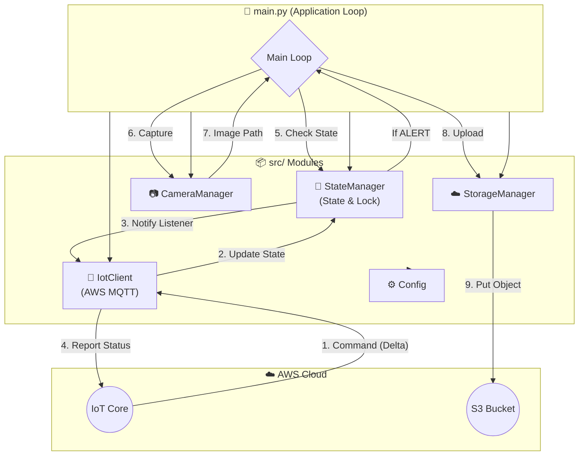

# 🍓 ElderlyCam - Device Client

Raspberry Pi上で動作する、高齢者見守りカメラシステムのクライアントアプリケーションです。
AWS IoT Coreと連携し、リモートからのステータス制御、および緊急時の画像撮影・S3アップロードを行います。

**設計思想:**
本プロジェクトは **「責務の分離 (Separation of Concerns)」** を徹底しており、コンポーネント間の疎結合を実現しています。また、`StateManager` によるスレッドセーフな状態管理と、オブザーバーパターンによる変更通知を採用しています。

## 📂 ディレクトリ構成

```text
~/ElderlyCam/
├── .env                # 環境変数 (機密情報: エンドポイント、バケット名など)
├── main.py             # エントリーポイント (各コンポーネントの配線・起動)
├── README.md           # 本ドキュメント
├── certs/              # AWS IoT Core 証明書 (※Git管理外)
│   ├── certificate.pem.crt
│   ├── private.pem.key
│   └── AmazonRootCA1.pem
└── src/                # ソースコード群 (モジュール)
    ├── __init__.py
    ├── config.py       # 設定管理 (.envローダー)
    ├── state_manager.py # ★状態管理 (Thread-safe & Observer Pattern)
    ├── mqtt_client.py  # AWS通信 (Pub/Sub)
    ├── camera.py       # カメラ操作 (OpenCVラッパー)
    └── storage.py      # ストレージ操作 (S3アップロード)

```

## 🧩 ソフトウェア・アーキテクチャ

システムは **「イベント駆動 (Event Driven)」** と **「ポーリング (Polling)」** のハイブリッド構成です。
`StateManager` がシステムの「心臓」となり、状態の変化を各コンポーネントに通知します。



## 🚀 セットアップ手順

### 1. 前提条件

- Raspberry Pi OS (Bookworm推奨)
- Python 3.9+
- AWS IoT Core 証明書が `certs/` に配置済みであること
- カメラモジュールが接続され、`libcamera` 等が有効であること

### 2. インストール

仮想環境を作成し、依存ライブラリをインストールします。

```bash
cd ~/ElderlyCam
python3 -m venv venv
source venv/bin/activate

# 必須ライブラリ
pip install --upgrade pip
pip install awsiotsdk boto3 opencv-python-headless python-dotenv RPi.GPIO

```

### 3. 環境変数の設定

プロジェクトルートに `.env` ファイルを作成し、環境に合わせて記述してください。

```bash
nano .env

```

**記述内容 (.env):**

```ini
IOT_ENDPOINT="xxxxxxxxxxxxx-ats.iot.ap-northeast-1.amazonaws.com"
S3_BUCKET="elderlycam-storage-xxxxxx"
THING_NAME="ElderlyCam_01"

```

※ `IOT_ENDPOINT` と `S3_BUCKET` はTerraformの出力 (`terraform output`) を参照してください。

## 🏃‍♂️ 実行方法

```bash
# 仮想環境を有効化 (必須)
source ~/ElderlyCam/venv/bin/activate

# アプリケーション起動
python main.py

```

停止するには `Ctrl+C` を押してください。終了処理が走り、MQTT接続が切断されます。

## 🛠 機能仕様

### ステータス管理 (StateManager)

AWS IoT Coreの Device Shadow と同期します。

1. **monitoring (見守りモード)**

- 通常時の待機状態。
- メインループは物理ボタンの押下を監視します（実装予定）。
- ボタン押下時、`State.update("alert")` を呼び出すことで遷移します。

2. **alert (緊急モード)**

- メインループが `alert` 状態を検知すると、以下の処理を繰り返します。

1. カメラ撮影 (`camera.py`)
2. S3へのアップロード (`storage.py`)
3. ローカル画像削除
4. 待機 (デフォルト: 5秒)

### 設計のポイント

- **スレッドセーフ:** `StateManager` は内部に `threading.Lock` を持ち、マルチスレッド環境（MQTTのコールバックとメインループの競合など）でも安全に動作します。
- **拡張性:** `main.py` で `state.add_listener()` を使うことで、「状態が変わった時にLEDを光らせる」などの機能追加が容易です。

## 🐛 トラブルシューティング

- **`Camera not found` エラー:**
- カメラ接続を確認し、`libcamera-dev` `libopenblas-dev` がインストールされているか確認してください。

- **AWS接続エラー:**
- `.env` のエンドポイントが正しいか確認してください。
- 証明書パスが `config.py` の定義と一致しているか確認してください。
