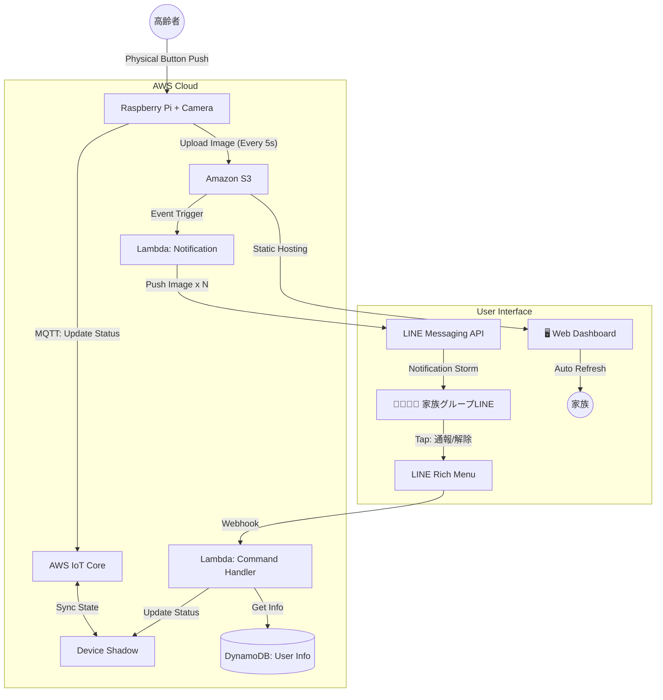

## 🚨 高齢者緊急通報システム (Raspberry Pi Edition)

### 1. プロジェクト概要

### 🎯 目的

高齢者の緊急時に、家族グループLINEへ**「気付くまで画像を送り続ける（通知の嵐）」**ことで、確実な認知と初動対応を実現する。

コストやAPI制限よりも、人命と対応スピードを最優先とした設計とする。

### 🔑 キーコンセプト

- **Continuous Alert:** 5秒に1回、現地の写真をLINEグループに投げ続ける。
- **Rich Menu Control:** 流れるタイムラインに依存せず、「通報」「誤報（解除）」を即座に行える固定メニューを採用。
- **Multi-View:** 複数台のカメラ映像はWebダッシュボードで一覧監視する。

---

### 2. システムアーキテクチャ

### 🏗 構成図 (Mermaid)

コード スニペット

---

### 3. 機能要件 & 実装詳細

### 📸 A. エッジデバイス (Raspberry Pi)

- **Hardware:** Raspberry Pi (Zero 2 W / 3B+ / 4 など) + Camera Module (または USB Webcam) + **物理ボタン (GPIO接続)**
- **Software Environment:** Raspberry Pi OS / Python 3.x
- **Libraries:** `boto3`, `awsiotsdk`, `opencv-python` (または `picamera`), `RPi.GPIO`

**基本動作:**

1. **待機モード:** Pythonスクリプト常駐。AWS IoT Device Shadow (`delta` トピック) を監視。GPIOボタンの入力を監視。
2. **緊急モード:**
   - ボタン押下、またはShadowの `status` が `alert` になると発動。
   - `cv2.imwrite` 等で撮影 → `boto3` でS3へアップロード（5秒間隔ループ）。
   - **ファイル名規則:** `camera_id/timestamp.jpg` (履歴保持)

**ボタン挙動:**

- **物理ボタン押下時 (GPIO Falling Edge):**
  - チャタリング処理を挟み、MQTTで `{"state": {"reported": {"status": "alert"}}}` をPublish。
  - 即座に撮影ループを開始。

### ☁️ B. クラウドロジック (AWS)

_(M5Stack版と同様だが、Python SDKとの親和性が高い)_

1. **AWS IoT Core & Shadow**
   - ステータス管理の単一情報源。
   - `status`: `monitoring` (通常) / `alert` (緊急)
2. **Amazon S3 & Lambda (通知の嵐)**
   - **トリガー:** `s3:ObjectCreated:Put`
   - **処理:** 画像がアップロードされた瞬間にLambdaが起動。
     - LINE Messaging API (`pushMessage`) を叩く。
   - **送信先:** 家族グループID (`GroupId`)
   - **内容:** 画像メッセージ（Original / Preview 共にS3のURL）
3. **LINE Bot & Lambda (司令塔)**
   - **トリガー:** LINE Webhook (Rich Menu Postback)
   - **処理 A:** 「大丈夫（誤報/対応済）」
     - Shadowを `monitoring` に更新 → **RasPi側がDeltaを検知して撮影ループ停止**。
     - LINEに「対応完了。システムを停止します」と通知。
   - **処理 B:** 「通報する」
     - DynamoDBから通報用テンプレートを取得。
     - LINEにテキスト送信（住所、電話番号、既往歴、解錠方法など）。
   - **処理 C:** 「通報完了」
     - 処理 A と同様にシステム停止。

### 📱 C. ユーザーインターフェース

1. **LINE (通知 & 操作)**
   - **グループLINE:** 鬼のような通知音。
   - **リッチメニュー (画面下固定):**
     - ボタン① [ 🚑 通報する ] (Action: Postback `action=report`)
     - ボタン② [ 🙆‍♀️ 大丈夫/停止 ] (Action: Postback `action=safe`)
     - ボタン③ [ 📹 Webカメラ一覧 ] (Action: URI `S3 Web Dashboard URL`)
2. **Web Dashboard (一覧監視)**
   - **S3 Static Website Hosting:**
   - **機能:** 全カメラの最新画像をグリッド表示。JSで5秒ポーリング。

---

### 4. データ設計

- **DynamoDB: EmergencyInfo テーブル** (変更なし)
  - `house_id` (PK), `address`, `phone`, `entry_method`, `medical_history`, `notes`

---

### 5. 開発ロードマップ (RasPi Edition)

- [ ] **Step 1: LINE Group Setup**
  - LINE Bot作成 & グループ招待 & groupId取得。
- [ ] **Step 2: AWS Base & RasPi Setup**
  - IoT Core (Thing作成, 証明書発行), S3, DynamoDB構築。
  - **RasPiセットアップ:** OS焼く、SSH有効化、Python環境構築 (`pip install awsiotsdk boto3 opencv-python`)。
  - AWS証明書をRasPi (`/home/pi/certs/`) に配置。
- [ ] **Step 3: "Alert Storm" Implementation**
  - **RasPi (Python):** GPIOボタン検知 → MQTT Publish 実装。
  - **RasPi (Python):** Shadow監視 → カメラ撮影 & S3アップロードループ実装。
  - Lambda: S3トリガー → LINE画像送信の実装。
- [ ] **Step 4: Control Logic**
  - LINEリッチメニュー適用。
  - Lambda: Postbackイベント（通報/停止）→ Shadow更新処理の実装。
- [ ] **Step 5: Web Dashboard**
  - HTML/JS作成 & S3配置。

---

### ⚠️ 運用上の注意 (同僚メモ)

1. **SDカードの寿命:** ログを書きすぎるとSDカードが死ぬぞ。OSの設定でSwap減らすか、ログは `/tmp` (RAMディスク) に逃がすとか工夫してくれ。いざという時に「SDカード破損で起動しません」は笑えない。
2. **電源:** M5Stackみたいにバッテリー内蔵じゃないから、ケーブル抜けたら即死する。ACアダプタの抜け止め対策か、モバイルバッテリーパススルー運用を検討したほうがいいかも。
3. **熱暴走:** 5秒ごとの撮影とアップロード、地味にCPU食うからケースの排熱は気にしといて。
